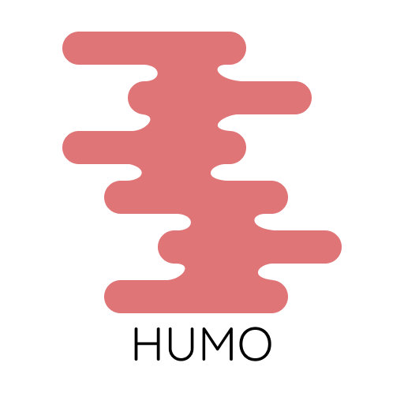

<h3>HUMO = Human Utec Middle (O)Internet</h3>

Unofficial API for UTEC EDU system (It works so slow as the original).
It's a alpha preview, you can read the main code (humo.py).
> It isn't UMA, It's HUMO!
